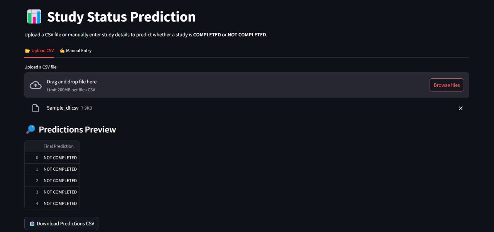

# Clinical Trial Outcome Prediction

Predict the completion status ("Completed" or "Not Completed") of clinical trials using structured and unstructured data such as study design, criteria, adverse events, and more. This project was developed for the Novartis Hackathon and leverages an ensemble of Random Forest and BioBERT models for robust predictions.

## 🚀 Deployed Demo

[Try the app on Hugging Face Spaces](https://huggingface.co/spaces/archis99/clinical-trial-prediction)

*Sample Output (screenshot):*

---

## Table of Contents
- [Overview](#overview)
- [Features](#features)
- [Architecture](#architecture)
- [Setup & Installation](#setup--installation)
- [Usage](#usage)
- [API Endpoints](#api-endpoints)
- [Testing](#testing)
- [Project Structure](#project-structure)
- [Requirements](#requirements)

---

## Overview
Clinical trials generate large amounts of structured and unstructured data. Predicting whether a trial will be completed is valuable for sponsors, researchers, and regulatory bodies. This project combines tabular features and text embeddings to make accurate predictions using:
- **Random Forest Classifier** for structured features
- **BioBERT** for unstructured text features
- **Ensemble** for final prediction

## Features
- Predict trial completion status from CSV or manual entry
- FastAPI backend for scalable inference
- Streamlit frontend for interactive UI
- Preprocessing pipeline for both tabular and text data
- Downloadable predictions

## Architecture
- **Backend:** FastAPI (REST API), model loading, inference
- **Frontend:** Streamlit (CSV upload, manual entry, results visualization)
- **Models:** Random Forest, BioBERT (Hugging Face), ensemble logic
- **Preprocessing:** Cleaning, encoding, scaling, text embedding

## Setup & Installation
1. **Clone the repository:**
	```powershell
	git clone https://github.com/Harsh-IITG/Clinical-Trial-Outcome-Prediction.git
	cd Clinical-Trial-Outcome-Prediction-main
	```
2. **Install dependencies:**
	```powershell
	pip install -r requirements.txt
	```
3. **Download models:**
	Models are automatically downloaded from Hugging Face Hub on first run.

## Usage
### Run Backend (API)
```powershell
cd backend
uvicorn main:app --reload --host 127.0.0.1 --port 8000
```

### Run Frontend (Streamlit)
```powershell
cd frontend
streamlit run app.py
```

### Try Online
- [Hugging Face Space](https://huggingface.co/spaces/archis99/clinical-trial-prediction)

## API Endpoints
- `GET /health` — Health check
- `POST /predict` — Predict trial status
  - **Input:** JSON object or list of objects (trial features)
  - **Output:** Prediction results

## Testing
Unit tests are provided in the `tests/` folder. Run with:
```powershell
pytest tests/
```

## Project Structure
```
├── backend/         # FastAPI backend, models, pipelines
├── frontend/        # Streamlit app
├── data/            # Data files
├── embeddings/      # Embedding files
├── notebooks/       # Jupyter notebooks (EDA, experiments)
├── tests/           # Unit tests
├── requirements.txt # Python dependencies
└── README.md        # Project documentation
```

## Requirements
See `requirements.txt` for all dependencies. Key packages:
- numpy, pandas, scikit-learn
- fastapi, uvicorn
- streamlit
- torch, transformers, huggingface_hub

---

## Acknowledgements
- Developed for Novartis Hackathon
- BioBERT: [emilyalsentzer/Bio_ClinicalBERT](https://huggingface.co/emilyalsentzer/Bio_ClinicalBERT)
- Model hosting: [archis99/Novartis-models](https://huggingface.co/archis99/Novartis-models)

## License
This project is for educational and research purposes.
